# ApexForge Gym Platform — System Documentation

This document describes the **ApexForge Gym** web application: a modern, fully responsive gym and fitness platform. It covers purpose, architecture, actors, and behavioral models using standard diagrams.

---

## 1. Project Overview

| Item | Description |
|------|-------------|
| **Name** | ApexForge Gym Platform |
| **Type** | Full-stack web application |
| **Frontend** | HTML, CSS, Vanilla JavaScript (static pages in `client/public`) |
| **Backend** | Node.js, Express.js REST API |
| **Database** | MongoDB with Mongoose ODM |
| **Auth** | JWT (JSON Web Tokens) + bcrypt password hashing |
| **Default URL** | `http://localhost:5000` |

### Main capabilities

- User registration, login, password reset, and profile management
- Membership plan browsing and subscription
- BMI calculator with personalized advice and history (logged-in users)
- Trainer directory, subscription, and personalized “check plans” (machines + nutrition)
- Gym machine catalog with search and filters
- Supplement shop: browse, wishlist, cart, and checkout
- Contact form and newsletter subscription
- Admin dashboard: stats, users, orders, and CRUD for plans, trainers, supplements, and machines

### Pages (client)

| Page | Path | Purpose |
|------|------|---------|
| Home | `/index.html` | Landing, stats, newsletter |
| Plans | `/plans.html` | Membership tiers |
| BMI | `/bmi.html` | BMI calculator |
| Trainers | `/trainers.html` | Trainer listings and booking |
| Machines | `/machines.html` | Equipment catalog |
| Supplements | `/supplements.html` | Product shop and cart |
| Auth | `/auth.html` | Login, register, forgot/reset password |
| Profile | `/profile.html` | User dashboard |
| Admin | `/admin.html` | Admin panel |
| Contact | `/contact.html` | Contact form |

---

## 2. Context Diagram

A **context diagram** (Level 0 DFD) shows the system as one process and its interactions with external entities.

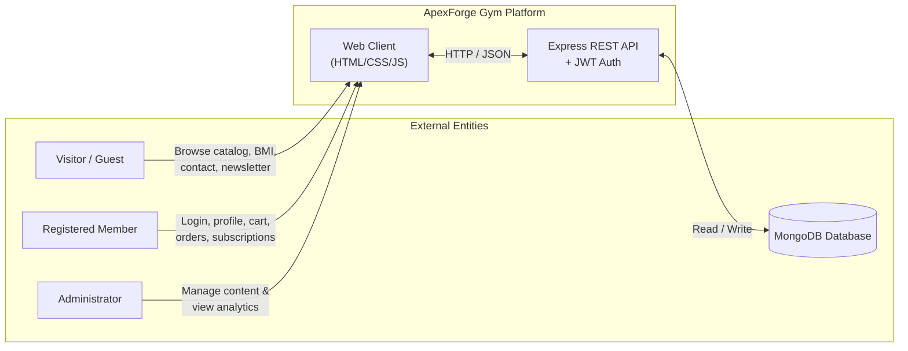

**Boundary:** Everything inside the box is the ApexForge system. Visitors use public features without authentication; members and admins use protected API routes via JWT.

---

## 3. Use Case Diagram

Actors and their primary use cases.

```mermaid
flowchart TB
    subgraph Actors
        Guest((Guest))
        User((Member))
        Admin((Admin))
    end

    subgraph Public["Public Use Cases"]
        UC1[Browse Home & Content]
        UC2[View Membership Plans]
        UC3[Calculate BMI]
        UC4[Browse Trainers]
        UC5[Browse Machines]
        UC6[Browse Supplements]
        UC7[Submit Contact Form]
        UC8[Subscribe to Newsletter]
    end

    subgraph Auth["Authentication"]
        UC9[Register Account]
        UC10[Login]
        UC11[Forgot Password]
        UC12[Reset Password]
    end

    subgraph Member["Member Use Cases"]
        UC13[View Profile]
        UC14[Subscribe to Membership Plan]
        UC15[Save BMI History]
        UC16[Subscribe to Trainer]
        UC17[Manage Wishlist]
        UC18[Manage Cart]
        UC19[Checkout Order]
        UC20[View Order History]
    end

    subgraph AdminUC["Admin Use Cases"]
        UC21[View Dashboard Stats]
        UC22[Manage Users & Orders]
        UC23[CRUD Plans]
        UC24[CRUD Trainers]
        UC25[CRUD Supplements]
        UC26[CRUD Machines]
    end

    Guest --> UC1 & UC2 & UC3 & UC4 & UC5 & UC6 & UC7 & UC8
    Guest --> UC9 & UC10 & UC11

    User --> UC10 & UC12 & UC13 & UC14 & UC15 & UC16 & UC17 & UC18 & UC19 & UC20
    User -.->|extends| UC3 & UC4 & UC5 & UC6

    Admin --> UC21 & UC22 & UC23 & UC24 & UC25 & UC26
    Admin -.->|inherits| User
```

### Use case summary

| ID | Use case | Actor | API / Notes |
|----|----------|-------|-------------|
| UC9 | Register | Guest | `POST /api/auth/register` |
| UC10 | Login | Guest, Member, Admin | `POST /api/auth/login` |
| UC14 | Subscribe to plan | Member | `POST /api/plans/subscribe` |
| UC15 | Save BMI | Member | `POST /api/auth/bmi` |
| UC16 | Subscribe to trainer | Member | `POST /api/trainers/subscribe` |
| UC18–19 | Cart & checkout | Member | `/api/cart/*`, `POST /api/orders/create` |
| UC21–26 | Admin operations | Admin | `/api/admin/*` (requires `role: admin`) |

---

## 4. Activity Diagrams

### 4.1 User registration and login

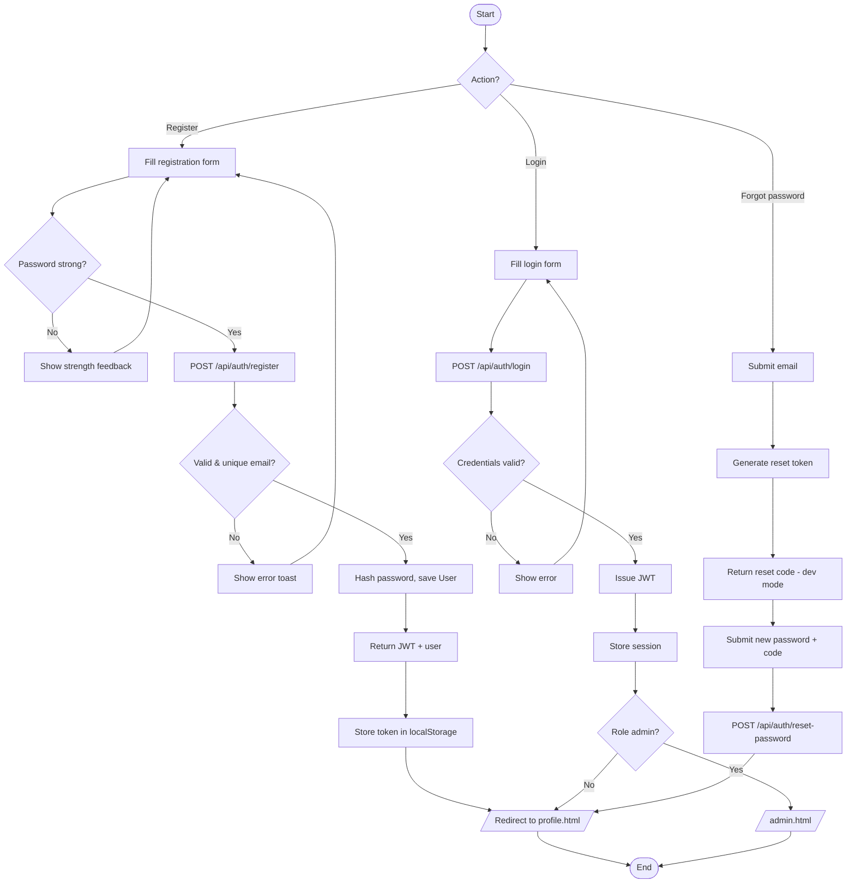

### 4.2 Supplement purchase flow

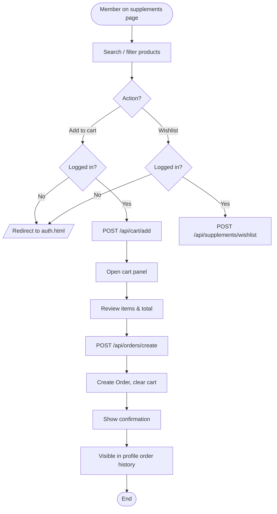

### 4.3 Trainer subscription flow

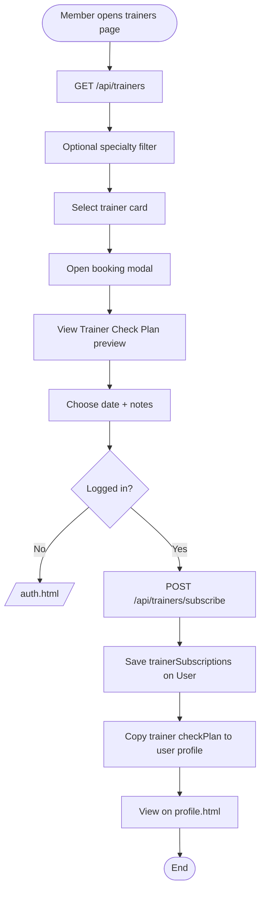

---

## 5. Sequence Diagrams

### 5.1 Login (authentication)

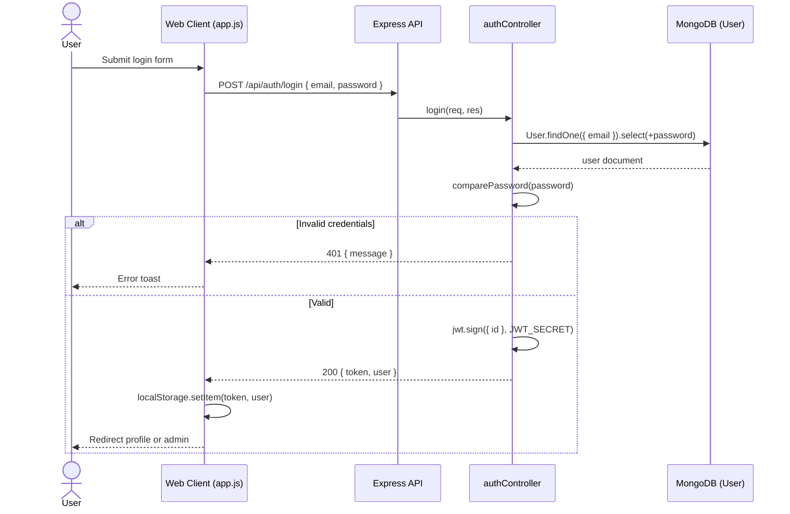

### 5.2 Protected request (e.g. profile)

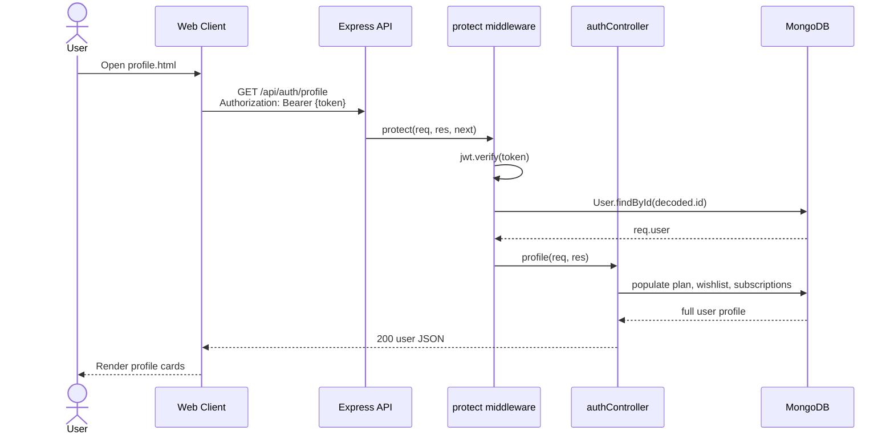

### 5.3 Add to cart and checkout

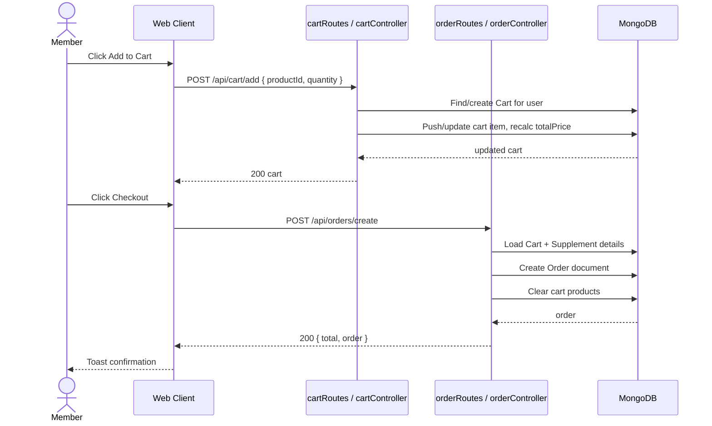

### 5.4 Admin CRUD (example: create supplement)

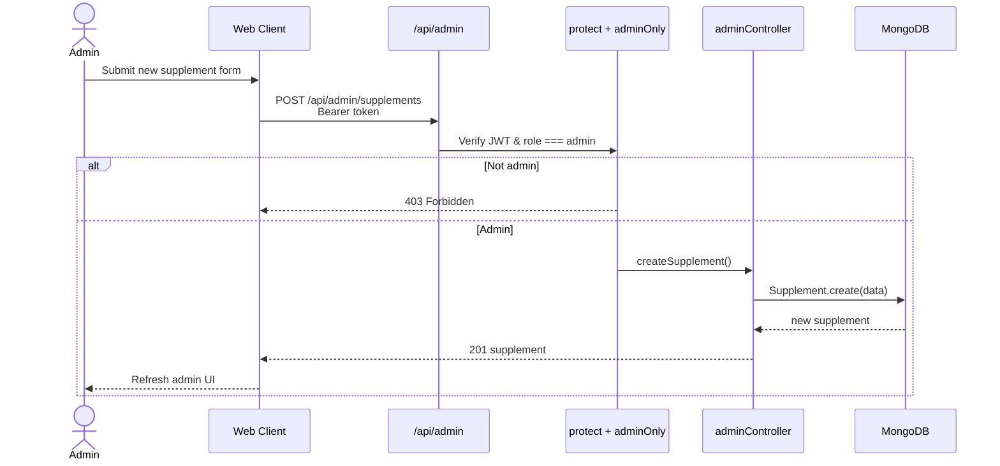

---

## 6. Class Diagram

Domain models (Mongoose schemas) and main server components.

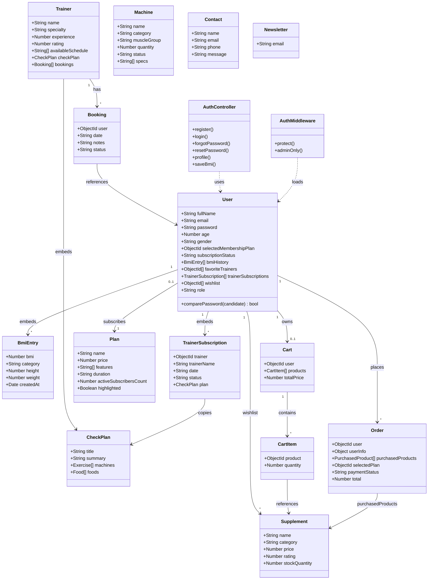

### API route map (logical layer)

| Module | Base path | Auth |
|--------|-----------|------|
| Auth | `/api/auth` | Mixed |
| Plans | `/api/plans` | Subscribe: protected |
| Trainers | `/api/trainers` | Subscribe: protected |
| Supplements | `/api/supplements` | Wishlist: protected |
| Machines | `/api/machines` | Public read |
| Cart | `/api/cart` | Protected |
| Orders | `/api/orders` | Protected |
| Contact | `/api/contact` | Public |
| Newsletter | `/api/newsletter` | Public |
| Admin | `/api/admin` | Protected + admin |

---

## 7. System Architecture

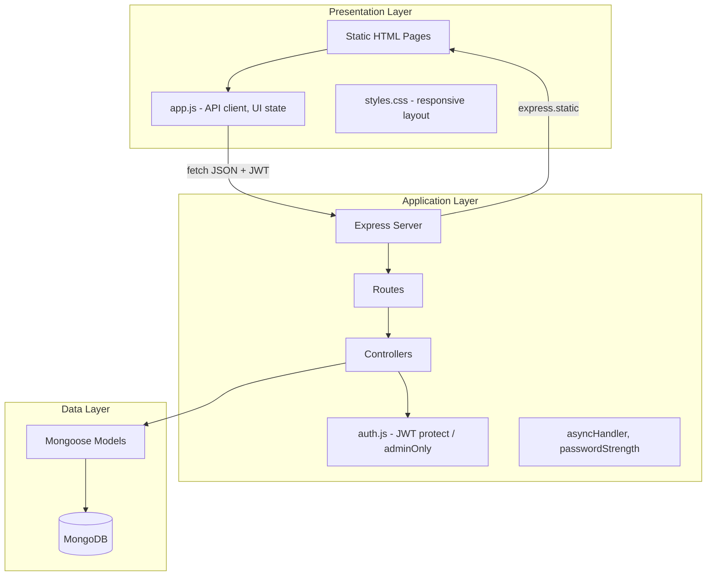

### Security model

1. Passwords hashed with **bcrypt** (12 rounds) on `User` pre-save.
2. **JWT** issued on login/register/reset; sent as `Authorization: Bearer <token>`.
3. `protect` middleware validates token and attaches `req.user`.
4. `adminOnly` restricts admin routes to `role: 'admin'`.
5. Client stores token in `localStorage` (`app.js` state).

---

## 8. Data Flow Summary

| User action | Client | Server | Persistence |
|-------------|--------|--------|-------------|
| Register | `POST /auth/register` | Hash password, create User | `users` |
| Login | `POST /auth/login` | Verify, return JWT | — |
| Choose plan | `POST /plans/subscribe` | Link plan to user | `users`, `plans` |
| BMI save | `POST /auth/bmi` | Push to `bmiHistory` | `users` |
| Trainer subscribe | `POST /trainers/subscribe` | Embed subscription + booking | `users`, `trainers` |
| Add to cart | `POST /cart/add` | Upsert cart line | `carts` |
| Checkout | `POST /orders/create` | Order from cart | `orders`, `carts` |
| Contact | `POST /contact` | Save message | `contacts` |
| Newsletter | `POST /newsletter/subscribe` | Save email | `newsletters` |

---

## 9. Environment & Deployment Notes

| Variable | Purpose |
|----------|---------|
| `PORT` | Server port (default 5000) |
| `MONGO_URI` | MongoDB connection string |
| `JWT_SECRET` | Token signing secret |
| `CLIENT_URL` | CORS origin |

**Run:** `npm install` → configure `.env` → `npm run seed` → `npm run dev`

**Seeded admin:** `admin@apexforge.test` / `Admin123!`

---

## 10. Diagram Index

| Diagram | Section | Purpose |
|---------|---------|---------|
| Context diagram | §2 | System boundary and external actors |
| Use case diagram | §3 | Functional requirements by actor |
| Activity diagrams | §4 | Workflows: auth, shop, trainers |
| Sequence diagrams | §5 | Message order between components |
| Class diagram | §6 | Domain model and relationships |
| Architecture diagram | §7 | Layered structure |

---

*Generated for the ApexForge Gym Platform codebase. Diagrams use [Mermaid](https://mermaid.js.org/) syntax and render in GitHub, GitLab, VS Code (with extension), and many Markdown viewers.*
